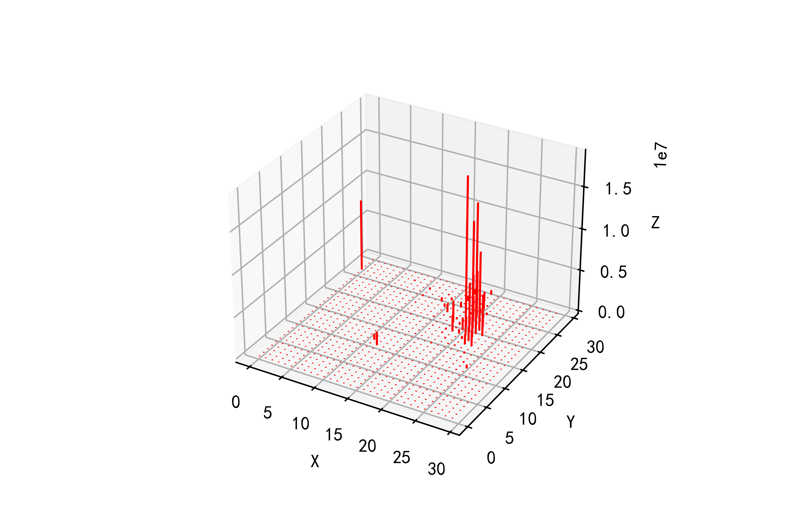
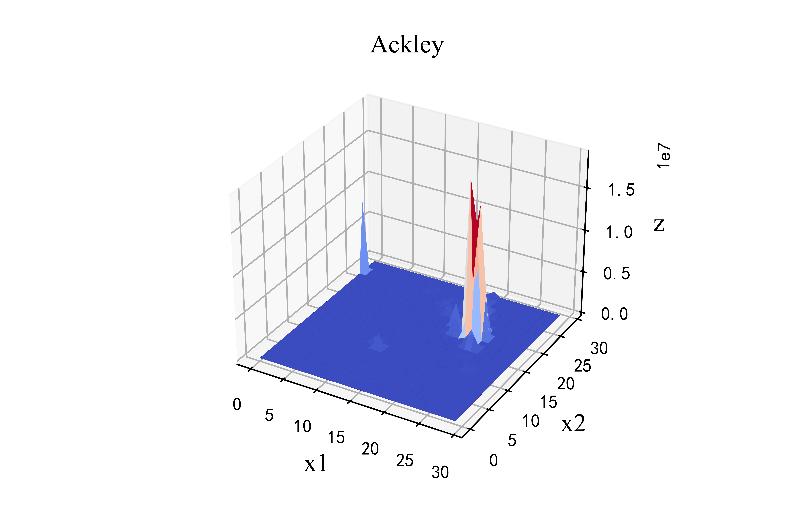
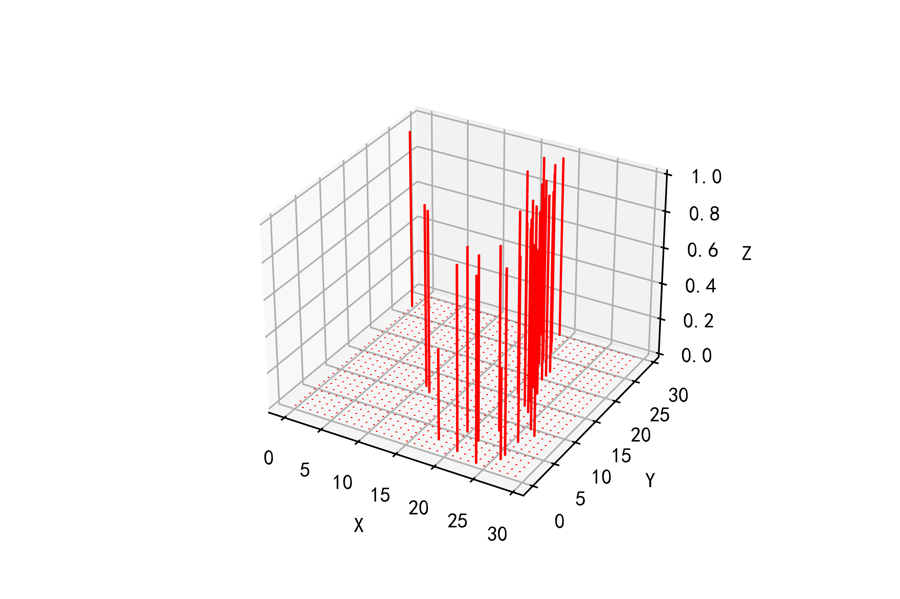
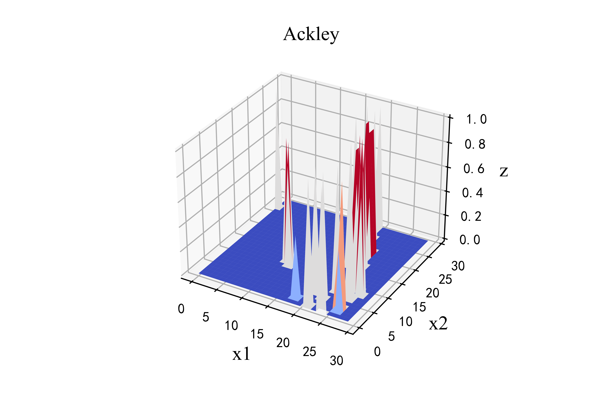
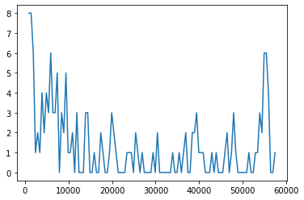

# 代码介绍

## 数据说明

代码构建了Taxi_Trips数据的UCTB数据集。该数据大小为52.6GB，下载见[百度网盘](https://pan.baidu.com/s/1cxLDAbNpYLLbBcNSm6s86w)，提取码为:39q3

在仓库中，为了方便同学测试代码，在"/Chicago Taxi/Taxi_Trips/"文件夹下放置了一个迷你的csv文件，内部总共有5行来自源数据的记录。

在"/output_data/"文件夹下存放了经过处理后的数据对象。

## 代码详细介绍

代码以ipynb文件给出，分为“Build”、“Build TimeFitness、Time Range and LenTimeSlots”、“Build Node”和“Build Dict”四个板块。鉴于在关键板块中，处理数据集的时间过长(5h)，代码中给出了“运行”和“验证”两种模式。具体来说，是通过一个布尔型变量run来切换模式。例如：

```python
run=False
if run:
    # 2013-01-01 00:00:00	2022-02-28 22:45:00
    time_format ='%m/%d/%Y %I:%M:%S %p'
    TrafficGrid = np.zeros([time_len, w, h])
    reader = pd.read_csv('H:\时空预测\Chicago Taxi\Taxi_Trips\Taxi_Trips.csv', chunksize=4000)
    for chunk in reader:
        chunk.drop(chunk[np.isnan(chunk['Pickup Centroid Latitude'])].index, inplace=True)
        for ind, row in chunk.iterrows():
            lat = row['Pickup Centroid Latitude']
            lng = row['Pickup Centroid Longitude']
            # print(lat, lng)
            i, j = get_grid_index(lat, lng)
            try:
                dt = datetime.datetime.strptime(row['Trip Start Timestamp'], time_format)
                TrafficGrid[get_time_slot_index(dt), i, j] += 1
                # 共打印12305次
                if ind % 10000==0:
                    print(dt)
                    # print(TrafficGrid[get_time_slot_index(dt)])
            except:
                print('出错！')
else:
    TrafficGrid = np.load('arr_with_data.npy')
```

这是build TrafficGrid板块的部分代码，运行时长大概为5h，如果选用非运行模式，则直接加载之前运行的np数据，仅需十秒左右。

在运行时，发现一些数据的'Trip Start Timestamp'或者'Pickup Centroid Latitude'字段为空，经统计，总共数据有139,600,000条，被正确处理的数据有122,963,134条。

# 实验环境

(1) python: 3.7.13
(2) numpy: 1.21.5
(3) pickle: 0.7.5
(4) pandas: 1.3.5

# 运行的结果

本文对构建的Grid格式和Node格式的数据集进行了可视化分析。

## Grid

三维柱状图：



三维图：



经softmax处理后的三维柱状图：



经softmax处理后的三维图：



## Node

我们将Grid格式下数据较多的150个网格进行切分，每个网格切分成了16个网格，每个网格被认为是一个独立的节点。这2400个节点的数据条数最多的为57663条，所以，将[1, 57663]切分成116个长度为500的区间，统计数据条数位于某个区间的节点个数

